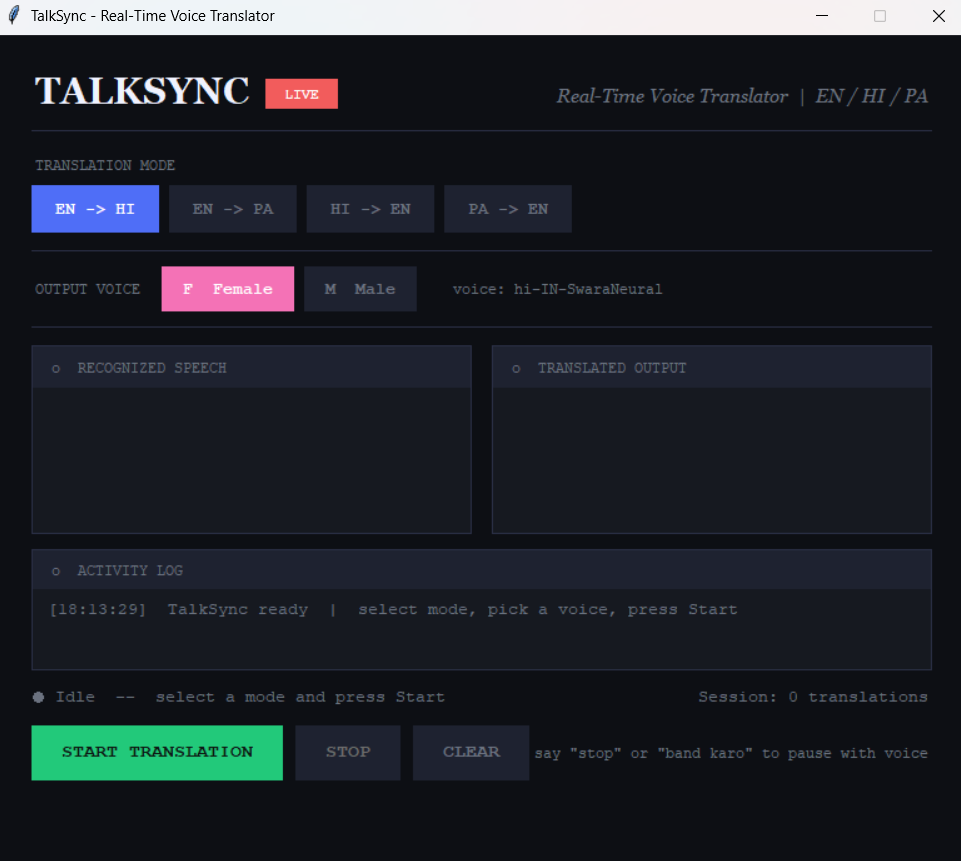

# TalkSync — Real-Time Voice Translator

A desktop application that translates speech in real time between **English**, **Hindi**, and **Punjabi** with male and female voice output.

---

## Screenshot



---

## How to Use

### 1. Start the app
```bash
python translator.py
```

### 2. Select a Translation Mode
Click one of the 4 mode buttons at the top:

| Button | Translates |
|---|---|
| EN -> HI | English speech → Hindi voice |
| EN -> PA | English speech → Punjabi voice |
| HI -> EN | Hindi speech → English voice |
| PA -> EN | Punjabi speech → English voice |

### 3. Select Voice Gender
Click **F Female** or **M Male** to choose the output voice.

### 4. Click "START TRANSLATION"
- The status dot turns **green** — app is listening
- Speak into your microphone
- Your speech appears in the **Recognized Text** box
- Translation appears in the **Translated Text** box
- The translated text is spoken aloud automatically

### 5. Switch modes anytime
Just click a different mode button — the app **automatically restarts** in the new mode. No need to stop and start manually.

### 6. Stop the app
- Click **STOP** button, or
- Say **"stop"** or **"band karo"** into the mic

### 7. Clear the text boxes
Click **CLEAR** to wipe both text boxes.

---

## Status Indicators

| Color | Meaning |
|---|---|
| Green dot | Listening for speech |
| Orange dot | Processing / translating |
| Blue dot | Speaking output |
| Red dot | Stopped or error |

---

## Installation

### Requirements
- Windows 10 / 11
- Python 3.10 or 3.11
- Internet connection
- Working microphone + speakers

### Setup
```bash
# 1. Clone the repo
git clone https://github.com/YOUR_USERNAME/TalkSync.git
cd TalkSync

# 2. Create virtual environment
python -m venv talksync_env
talksync_env\Scripts\activate

# 3. Install dependencies
pip install -r requirements.txt

# 4. Run
python translator.py
```

### Install PyAudio on Windows (if needed)
```bash
pip install pyaudio
```
If that fails:
```bash
pip install pipwin
pipwin install pyaudio
```

---

## Build as .exe for clients

```bash
pyinstaller --onefile --windowed --name "TalkSync" translator.py
```
The `.exe` will be in the `dist/` folder — send it to your client, no Python needed.

---

## Tech Stack

| Component | Library |
|---|---|
| Speech Recognition | `SpeechRecognition` + Google Speech API |
| Translation | `deep-translator` (Google Translate) |
| Hindi / English TTS | `edge-tts` (Microsoft Neural voices) |
| Punjabi TTS | `gTTS` + `pydub` (pitch shift for male voice) |
| UI | `tkinter` |
| Audio Playback | `pygame` |

---

## Voice Commands
Say **"stop"** or **"band karo"** to stop translation hands-free.

---

## Project Structure
```
TalkSync/
├── translator.py        # Main application
├── requirements.txt     # Python dependencies
├── screenshot.png       # App screenshot
└── README.md            # This file
```